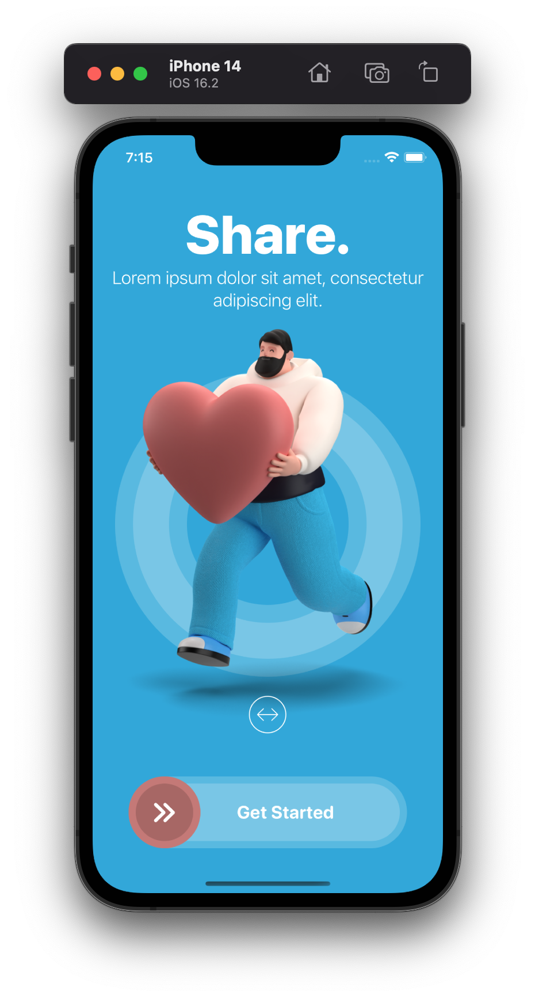
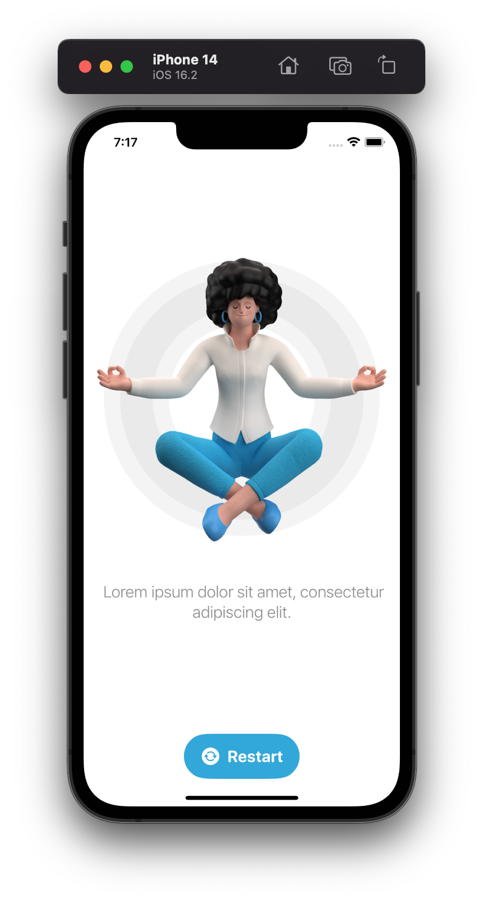

    

  <h3 align="center">Restart</h3>

https://user-images.githubusercontent.com/80220432/229626234-d5b10164-4c18-4d40-b204-235c4dfe4826.mov

## About the project

This project demonstrates the use of the SwiftUI framework to create beautiful layouts using illustrations along with smooth animations.

### Views

  
  
 

  
  These pages were constructed using:
  
  * A combination of stacks (***HStack, VStack and ZStack***).
  * Component life cycles to implement entering and exiting animations of child components(***onAppear***).
  * ***Overlays*** for overlapping views.
  * ***DragGesture*** to slide the button to transit to secondary screen.
  * ***NavigationLink*** to transition between pages.
  * Various animations (***easeout, easein, delayed animations,*** ...)
  * ***@State*** and ***@AppStorage*** property wrappers to achive inter-component communication and UI update

## Meta

Jash Dhinoja

[https://github.com/jash-dhinoja/Restart](https://github.com/jash-dhinoja/)
